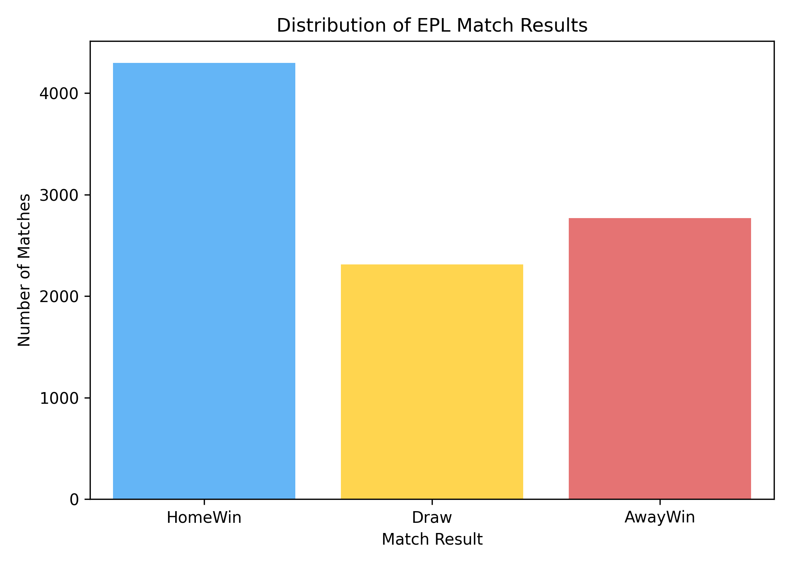
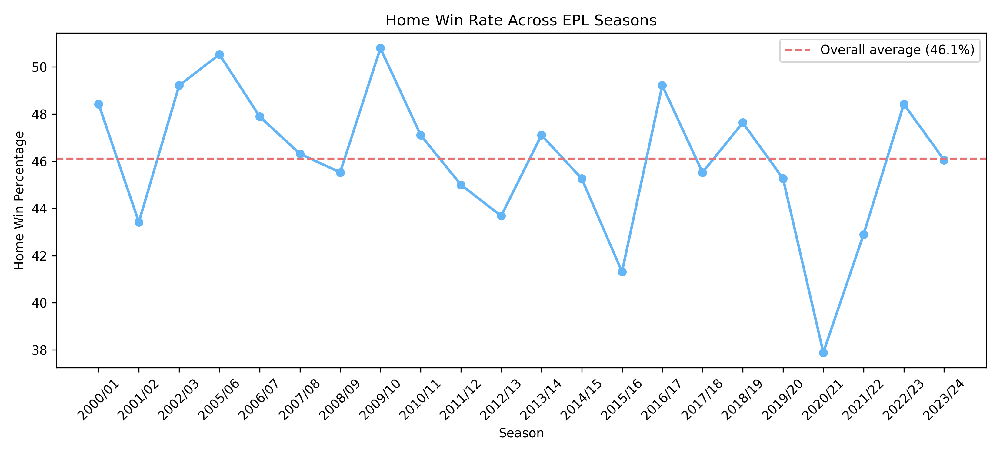
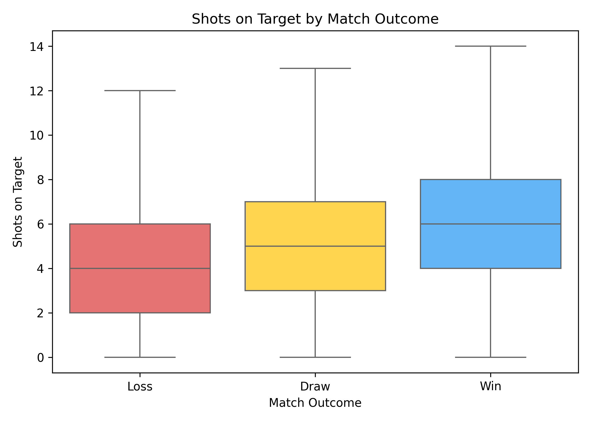
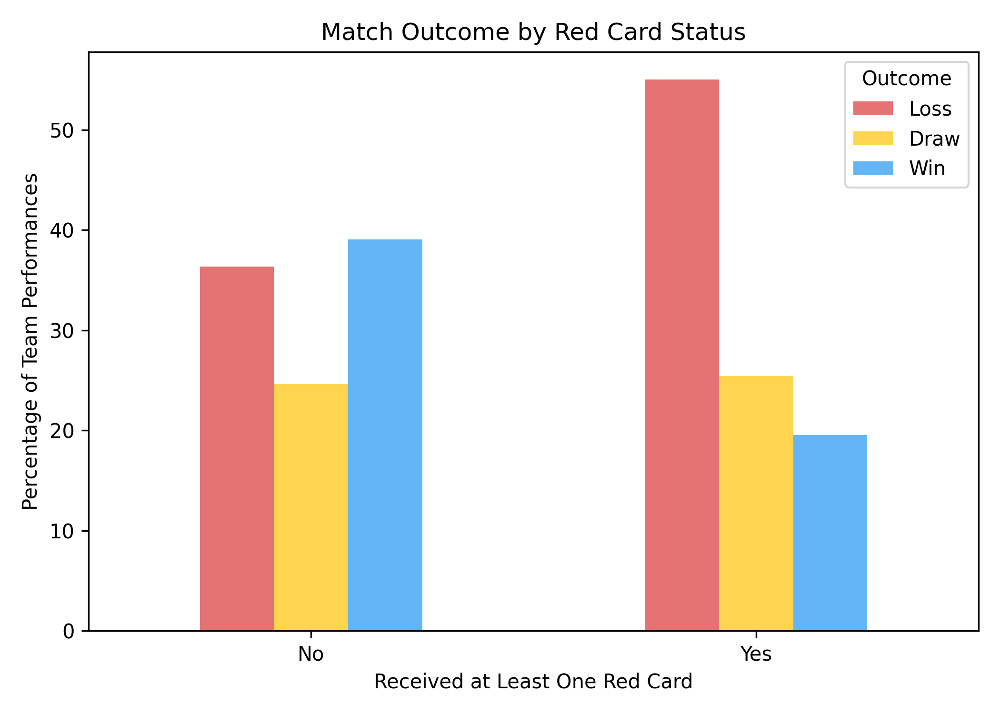
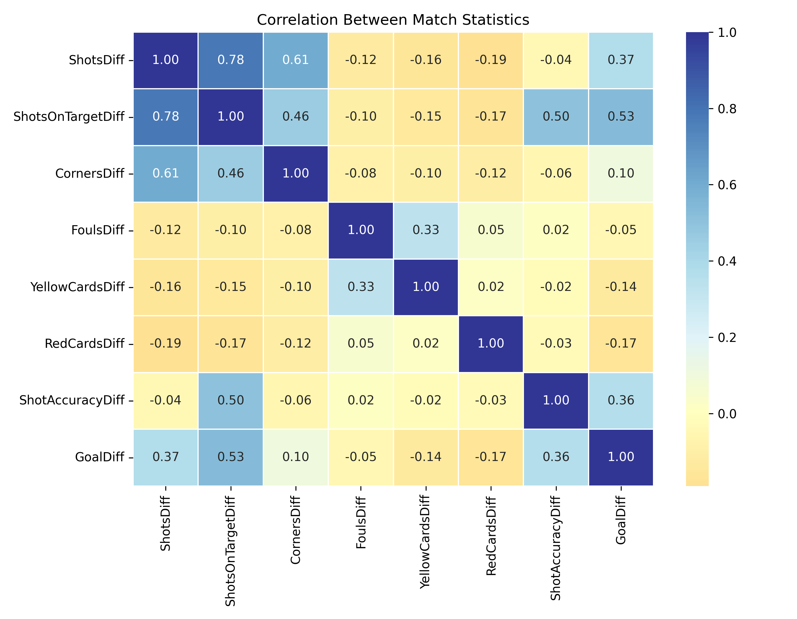
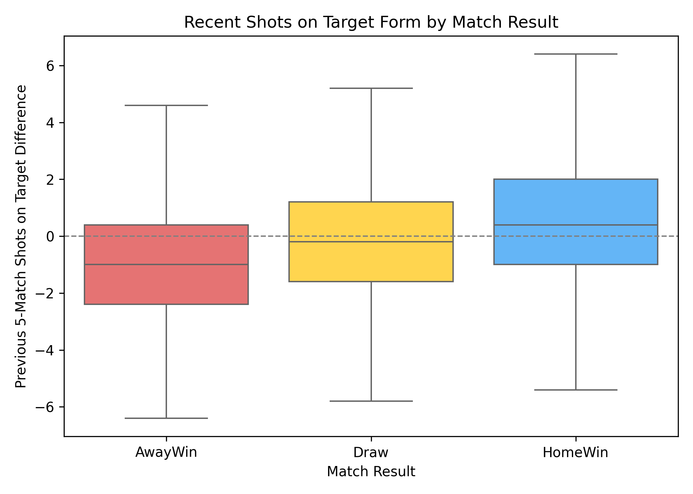
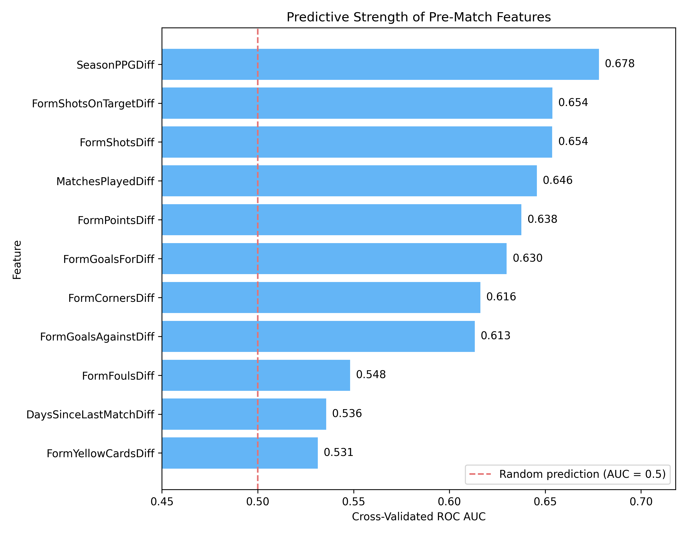

# Exploratory Data Analysis

This exploratory data analysis (EDA) supports the project aim of identifying which EPL match characteristics are associated with winning and which patterns from historical matches may be useful for predicting future results. The analysis therefore moves from overall match outcomes, to in-match performance, and finally to historical form that is available before a future match begins.

## 1. Match outcomes and home advantage

The first step was to examine the overall distribution of match results.

Home teams won **45.83%** of matches, compared with **29.51%** away wins and **24.66%** draws. This suggests a clear overall home advantage in the dataset.

However, the strength of this advantage was not constant across seasons.

Across complete seasons, the home-win rate fluctuated around an overall average of approximately **46.1%**. Some seasons differed substantially from this average, with **2020/21** showing an especially low home-win rate. This indicates that home advantage may depend on season-specific conditions rather than remaining constant over time.

## 2. Match performance associated with winning

The next stage examined what winning teams tended to do differently during matches.

Shots on target showed a clear pattern across outcomes. Winning teams averaged **6.66** shots on target, compared with **5.05** for draws and **4.19** for losses. The distributions also shifted upward from losses to wins. However, there was still substantial overlap between the groups, showing that shots on target are associated with winning but do not determine the result by themselves.

Discipline was also related to match outcomes.

Teams receiving at least one red card lost approximately **55.03%** of their matches and won only **19.52%**. In comparison, teams without a red card lost **36.34%** and won **39.06%**. This is a strong association, although it should not be interpreted as causal because match state may also influence the likelihood of receiving a red card.

The correlation analysis provides a broader comparison across in-match statistics.

The difference in shots on target had the strongest association with goal difference (**r = 0.53**). Total-shot difference (**r = 0.37**) and shot-accuracy difference (**r = 0.36**) showed moderate relationships, while corners (**r = 0.10**) and fouls (**r = -0.05**) were much weaker. Overall, attacking effectiveness appears more closely related to match success than several other available match statistics.

## 3. From historical performance to pre-match information

Statistics from the current match cannot be used to predict that same match before kick-off. However, once a match has been played, its statistics become historical information that can be used to describe a team's recent form before its next fixture.

The previous five-match shots-on-target difference showed a visible relationship with the following match result. Home wins tended to occur when the home team had stronger recent shots-on-target form relative to its opponent, while away wins tended to occur when this difference was lower. This connects the post-match EDA to the later prediction stage: patterns observed in completed matches can be transformed into pre-match historical features.

As an exploratory screening step, the standalone predictive information in the available pre-match features was also compared.

`SeasonPPGDiff` produced the strongest individual signal (**AUC = 0.678**), followed by `FormShotsOnTargetDiff` and `FormShotsDiff` (**AUC = 0.654** each). In contrast, recent fouls, rest-day difference and yellow-card history were much closer to random prediction. This ranking is not a final predictive model, but it helps identify which historical features may be most useful for the subsequent modelling stage.

## Summary

Overall, the EDA suggests that **home advantage, attacking effectiveness, discipline and recent team form** are important dimensions of EPL match outcomes. In-match shots on target showed the clearest relationship with winning, while historical attacking form and season-to-date team strength also contained useful information before future matches. These findings provide a clear basis for the next stage of predictive modelling.
