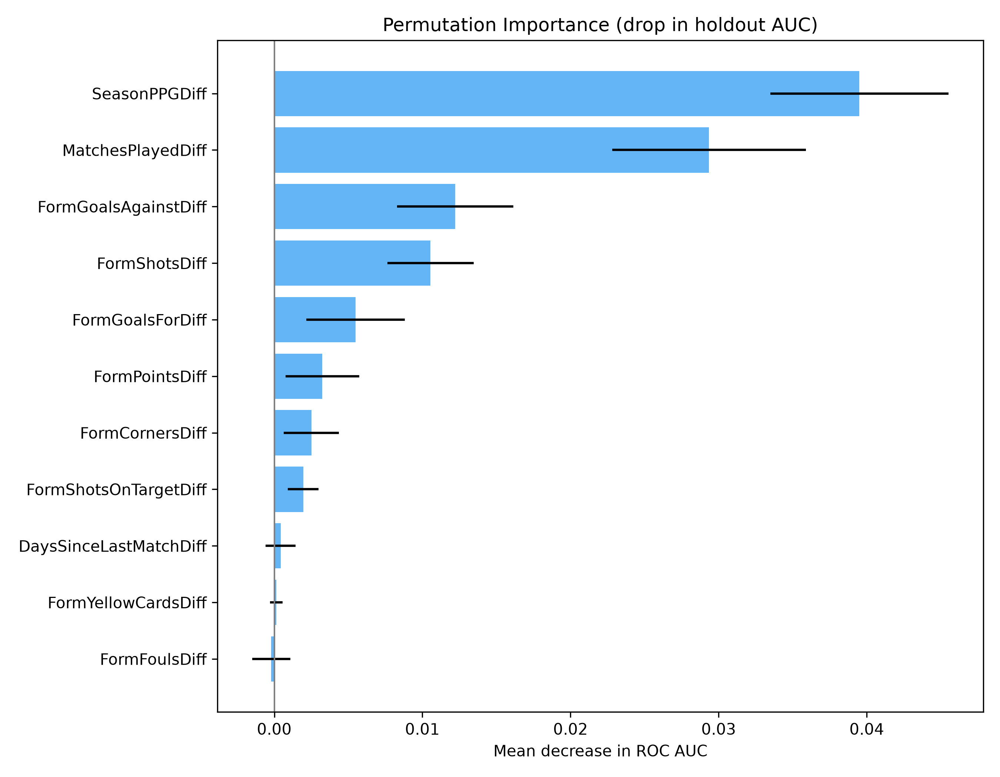
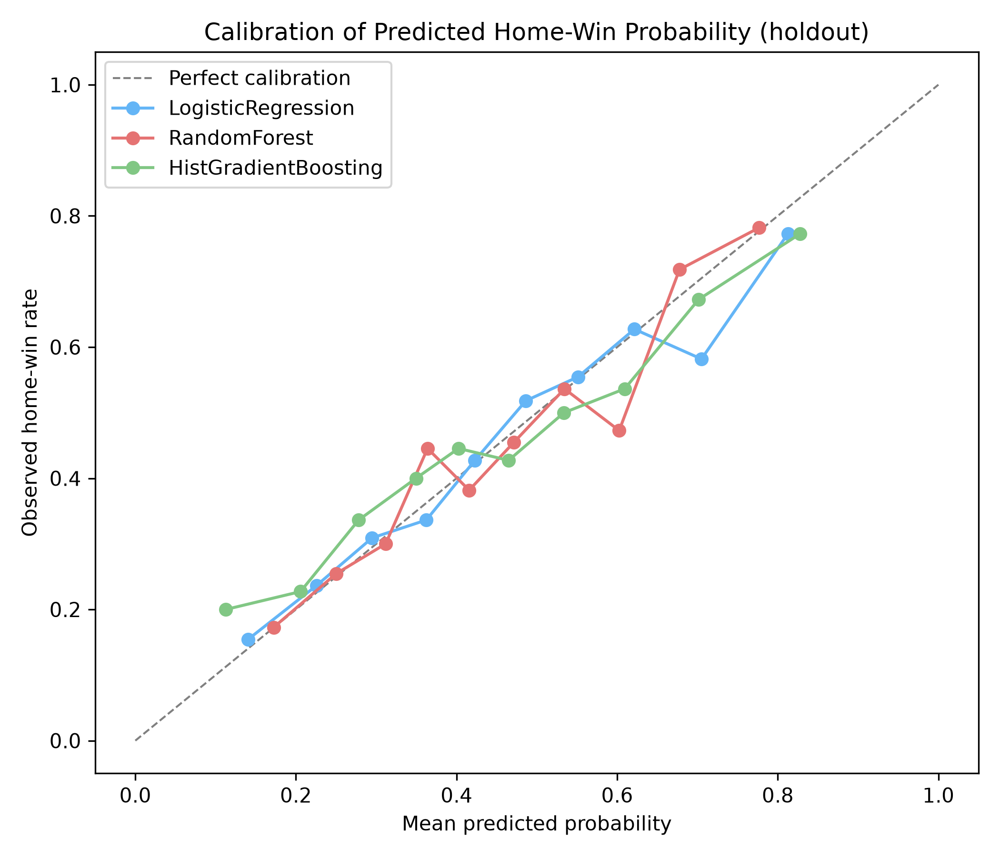
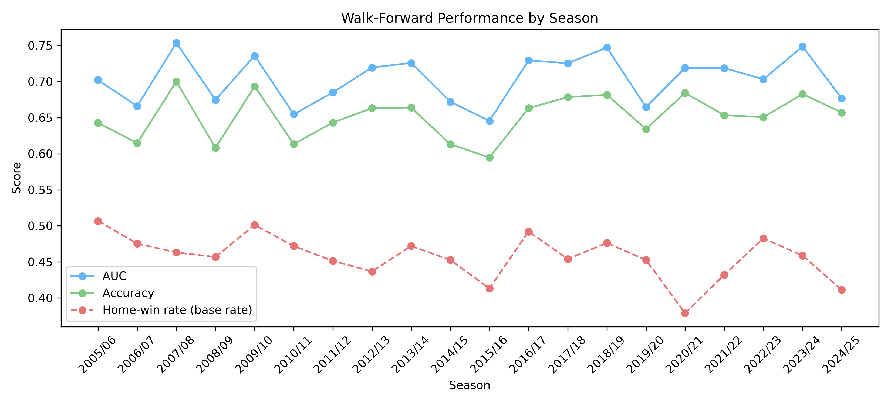

# Predictive Modelling

This stage addresses the predictive side of the project: can the result of an EPL fixture be forecast before kick-off using only information available at kick-off, and which of those signals carry the most weight? The exploratory analysis in [EDA.md](EDA.md) established that home advantage, attacking effectiveness and recent form are associated with winning. Association is not forecasting, so this stage tests how much of that signal survives when the model is only allowed to see the past.

All models are fitted on `epl_features.csv`, the leak-free table produced by `EPLdatacleaningscript.py`. Every feature in it is a lagged summary of matches already played; no statistic from the match being predicted is available to the model.

## 1. Setup

The 9,202 usable matches span 2000/01 to 2024/25. The last three seasons (2022/23 to 2024/25, 1,100 matches) are held out entirely, and the earlier 8,102 matches are used for training and cross-validation. The split is made on season rather than at random: a random split would allow a model to train on 2024 and be tested on 2010, using information it could never have had before kick-off. Cross-validation within the training seasons uses `TimeSeriesSplit`, the same expanding time-ordered scheme used for the feature ranking in the EDA.

Two targets are modelled. The **binary** target is `HomeWin` (1 = home win, 0 = draw or away win), and the **three-class** target is the full result. Two feature framings are compared: the **11 home-minus-away differentials**, and the **22 per-side levels** they are derived from. Both encode the same eleven underlying quantities.

## 2. Why probability metrics, not just accuracy

Four metrics are reported. **Accuracy** is the proportion of correct predictions, but it only sees which side of 0.5 a prediction fell on: a 0.51 and a 0.99 forecast are identical to it. **ROC AUC** measures ranking, that is, the probability that a randomly chosen home win is scored above a randomly chosen non-home-win. **Log loss** and the **Brier score** measure how good the predicted probabilities themselves are, and both are proper scoring rules: they are minimised only when the model reports what it genuinely believes.

That distinction matters here because the research question is about how much signal exists, not simply about naming a winner. A model that says 52% and a model that says 85% have found very different amounts of information, and collapsing both to "home win" discards exactly what is being measured.

The accuracy floor is set by the majority class. Home teams win **45.8%** of matches overall, so the majority class is *not a home win*, at **54.8%** of the holdout. Any model scoring below that has learned nothing.

## 3. Model comparison

Five models were fitted, arranged so that each answers the previous one: a baseline predicting the class base rates, logistic regression, a single unconstrained decision tree, a random forest, and histogram-based gradient boosting. Holdout results for the binary target on the differential features:

| Model | Log loss | Brier | AUC | Accuracy |
|---|---|---|---|---|
| Baseline | 0.689 | 0.248 | 0.500 | 0.548 |
| **Logistic regression** | **0.619** | **0.215** | **0.711** | **0.662** |
| Decision tree | 15.695 | 0.435 | 0.561 | 0.565 |
| Random forest | 0.623 | 0.217 | 0.703 | 0.651 |
| Gradient boosting | 0.631 | 0.220 | 0.696 | 0.645 |

**Logistic regression was the strongest model on every metric**, and the ordering was identical in cross-validation and on the holdout, for both targets and both feature framings. Its accuracy of **66.2%** exceeds the 54.8% floor by 11.4 points, and its AUC of **0.711** improves on the best single feature from the EDA (`SeasonPPGDiff`, AUC 0.678).

The decision tree is the informative failure. It scores **1.000 AUC in training and 0.561 on the holdout**, which is memorisation rather than learning, and it is the reason the two ensembles are included: bagging and boosting exist to control exactly that variance. Its log loss of 15.7 is not an error. An unconstrained tree outputs probabilities of exactly 0 or 1, so each confident mistake is charged the maximum penalty the metric allows. Its AUC says the model ranks badly; its log loss says the model is also certain of itself, which is worse.

That gap is the clearest argument for reporting probability metrics. Under accuracy alone the decision tree (56.5%) looks merely mediocre, and close to the baseline. Under log loss it is catastrophically worse than predicting the base rate.

For the three-class target the ordering is unchanged, with logistic regression again first (log loss **0.985** against a baseline of 1.063, AUC 0.650). The two targets are not directly comparable, because three outcomes carry more inherent uncertainty than two; what is comparable is the improvement over each target's own baseline.

## 4. Feature framings

Comparing the 11 differentials against the 22 per-side levels tests a specific hypothesis: that home and away form matter *asymmetrically*, so that a weak away defence is not simply the mirror image of a strong home attack. The differential encoding assumes only the gap between the teams matters.

**The hypothesis was not supported.** On holdout log loss, the differentials matched or beat the levels for every model: logistic regression 0.619 against 0.620, random forest 0.623 against 0.629, and gradient boosting 0.631 against 0.658. Doubling the number of features gained nothing and cost the tree-based models measurably. The eleven differentials are therefore used throughout.

## 5. What actually predicts a result

Feature importance is measured by permutation on the holdout: each feature is shuffled in turn and the resulting drop in AUC is recorded. This is preferred to impurity-based importance because several features are strongly correlated, and impurity importance divides credit between correlated features arbitrarily.

**Season-to-date strength and league longevity dominate recent form.** `SeasonPPGDiff` (**0.040**) and `MatchesPlayedDiff` (**0.029**) are far ahead of every five-match form feature, the largest of which is `FormGoalsAgainstDiff` at 0.012. Recent fouls, yellow cards and rest days contribute essentially nothing, which agrees with their near-random standalone AUCs in the EDA.

This is a more interesting result than it first appears. The EDA suggested that recent attacking form carried real signal, and on its own it does. But once season-long strength is in the model, most of that signal turns out to be redundant: a five-match window is a noisy estimate of something a full season measures better.

`MatchesPlayedDiff` deserves comment because it is not a football statistic. It counts how many matches each club has played within this dataset, so it acts as a proxy for how long a club has been established in the Premier League. It is legitimately available before kick-off and is not leakage, and it ranks second here and fourth on standalone AUC, so it is retained. Note that it is measured relative to the 2000/01 start of the data rather than to true club history.

**One caveat is essential when reading the figure.** `FormShotsOnTargetDiff` appears eighth despite scoring an AUC of 0.654 on its own in the EDA. This is a property of the method, not a contradiction: it correlates at r = 0.83 with `FormShotsDiff`, so shuffling one leaves the other intact and the model barely notices. A low permutation importance here means "redundant given the other features", not "uninformative".

## 6. Calibration

A reliability diagram compares predicted probabilities against observed outcomes. A perfectly calibrated model lies on the diagonal. For instance, if a match were rated at 70%, it should be home wins 70% of the time.

All three probabilistic models track the diagonal closely. Logistic regression is the best calibrated, with an expected calibration error of 0.027, which is expected because it optimises log loss directly over the same functional form it uses to predict. Gradient boosting is the worst at 0.047, since boosting pushes probabilities toward the extremes as each round works harder on previous errors.

Applying an explicit correction with `CalibratedClassifierCV` was tested and **did not help**. Isotonic regression reduced the gradient-boosting calibration error from 0.047 to 0.025, but log loss barely moved (0.631 to 0.629) and AUC fell slightly; on the random forest it made log loss worse. Since it did not change the model ranking, no calibration step is included in the final pipeline.

The three-class model produces one result that only calibration metrics can explain. Across 1,100 holdout matches it predicted a draw zero times, because a draw is almost never the single most likely outcome. Yet its mean predicted draw probability was 0.237, against an observed draw rate of 0.232. Measured by accuracy the model appears to know nothing about draws; measured by log loss it has learned their frequency almost exactly and simply cannot identify which particular matches will end level. The second description is the correct one.

## 7. Stability over time

To test whether performance depends on the era, the model was walked forward one season at a time, trained only on earlier seasons and tested on the next. **AUC remained between 0.65 and 0.75 across all twenty seasons with no downward trend**, so the relationship between pre-match form and results has been stable over twenty-five years.

Two seasons stand out. In **2020/21**, played almost entirely without crowds, the home-win rate fell to **37.9%**, the lowest in the data; the model's AUC nonetheless held at 0.719, tracking the shift rather than breaking on it. The weakest season was **2015/16** (AUC 0.646), the season Leicester City won the title as 5000-1 outsiders, and the most upset-heavy campaign in the league's history.

## 8. Limitations

**The holdout was inspected more than once.** It was intended for a single final evaluation, but twenty model configurations were scored against it. Cross-validation and holdout agree completely on the ordering, so the conclusion is not in doubt, but the model was selected on cross-validation and the holdout should be read as confirming that choice rather than as a fully independent test.

**No hyperparameter tuning was performed.** All models use library defaults apart from `min_samples_leaf=5` on the random forest. The finding is therefore that *an untuned* gradient boosting model did not beat logistic regression on these features, not that linear models are superior to boosting for this problem. A tuned boosting model might close or reverse the gap.

**Missing values are handled differently across models.** Logistic regression receives median-imputed values while the tree models handle NaN natively. Only 2.4% of rows are affected, so this cannot account for the differences observed, but the comparison is not perfectly controlled.

**The feature set is deliberately narrow.** It contains no betting odds, team news, injuries, lineups or expected-goals data, all of which are available before kick-off in practice and all of which would be expected to improve a forecast. Form also carries across season boundaries, so roughly 220 matches use form from a promoted club's previous spell in the league.

## Summary

A model restricted to pre-match information predicts Premier League results **substantially better than chance but far from reliably**: 66.2% accuracy against a 54.8% floor, and an AUC of 0.711. That is consistent with the ceiling implied by professional forecasters, who work with far richer information.

The clearest finding is that **logistic regression matched or beat every tree-based model**, in cross-validation and on the holdout, on all four metrics. With eleven smooth, correlated features and a genuinely uncertain outcome, the additional flexibility of ensembles fitted noise rather than signal. The most important predictors were **season-to-date points per game and Premier League longevity**, not the five-match form window that the exploratory analysis had highlighted; once season-long strength is accounted for, most short-run form is redundant.

The models are also **honest about their own uncertainty**. They are well calibrated, they track a structural break as large as the crowdless 2020/21 season, and in the three-class case they estimate the draw rate to within half a percentage point while never predicting a single draw outright. That combination is the substantive answer to the research question: pre-match form contains real and stable predictive information, and it is nowhere near enough to make football predictable.
